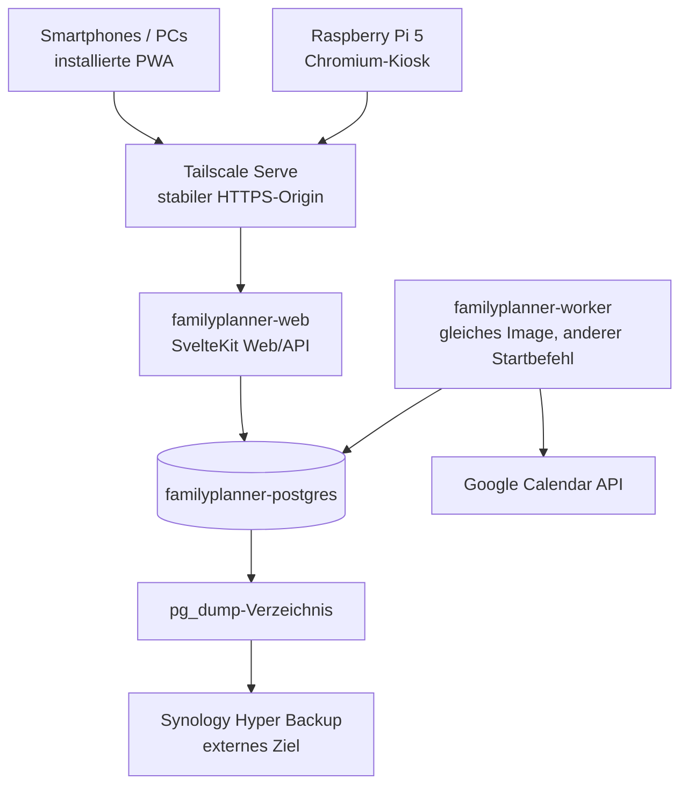

# Umsetzungsplan: Familienplaner

**Status:** Phase 0 – lokaler Runtimekern in Härtung; Gesamt-Go ausstehend
**Stand:** 2026-09-01
**Haushalt:** zwei Erwachsene, zwei Kinder im Alter von 7 und 10 Jahren

## 1. Zielbild

Der Familienplaner wird die gemeinsame digitale Anlaufstelle der Familie für Kalender, Aufgaben und motivierende Haushaltsbeiträge. Er läuft vollständig auf der Synology und erscheint auf drei Geräteklassen:

- Full-HD-Wanddisplay über einen Raspberry Pi 5,
- installierte PWA auf Smartphones,
- Webanwendung auf PCs und Tablets.

Der Raspberry Pi stellt ausschließlich die Oberfläche dar. Geschäftslogik, Zugänge, Synchronisation und persistente Daten verbleiben auf dem NAS.

## 2. Verbindliche Leitplanken

- Private Familienanwendung, keine öffentliche Internetfreigabe.
- Ein stabiler Tailscale-HTTPS-Origin für alle Geräte.
- Modularer Monolith statt Microservices oder Laufzeit-Plugins.
- SvelteKit 2, Svelte 5 und TypeScript Strict.
- Web/API und Worker als zwei Laufzeitrollen aus demselben Image.
- Eigener PostgreSQL-Container für den Familienplaner.
- Drizzle ORM mit geprüften, versionierten SQL-Migrationen.
- Better Auth, Passkeys und serverseitige Datenbanksitzungen.
- PostgreSQL-basierte Jobqueue mit pg-boss, kein Redis.
- Google-Familienkalender bleibt die verbindliche Kalenderquelle.
- Keine vertraulichen Inhalte persönlicher Kalender im Familienplaner.
- Append-only Ledger für Beitragspunkte und Belohnungseinlösungen.
- Betrieb zunächst mit 2 GB NAS-RAM, jedoch nur nach bestandenem Last- und Wiederanlauf-Spike.

Die DS225+ besitzt laut Hersteller einen Intel Celeron J4125, 2 GB Arbeitsspeicher ab Werk und eine offiziell unterstützte Maximalkapazität von 6 GB.[1]

## 3. Umfang des MVP

### Enthalten

1. Haushaltsmodus und vier persönliche Profile
2. Gleichberechtigte Erwachsenenverwaltung
3. Passkeys für Erwachsene
4. Kinderprofile mit Avatar, Farbe und kurzer PIN
5. Gemeinsamer Google-Familienkalender
6. Persönliche Kalender ausschließlich als Frei/Belegt
7. Heute-, Wochen- und Monatsansicht
8. Einmalige und wiederkehrende Aufgaben
9. Fest zugewiesene Aufgaben und freiwilliger Aufgabenpool
10. Persönliche und gemeinsame Aufgabensichtbarkeit
11. Erledigungsmeldung, Bestätigung und begründete Ablehnung
12. Beitragspunkte mit 1-/3-/5-Punkte-Skala
13. Belohnungskatalog und reservierte Einlösungswünsche
14. Nachvollziehbare Punktekorrekturen
15. Audit-Historie wichtiger Änderungen
16. Full-HD-Kioskbetrieb auf dem Raspberry Pi
17. Backup-, Update-, Healthcheck- und Rollback-Ablauf

### Bewusst nicht enthalten

- öffentlich erreichbare Anmeldung,
- Gastrolle,
- Geschwister-Rangliste,
- Kinderfotos,
- technische Steuerung von Switch- oder Tabletzeit,
- Push-Benachrichtigungen,
- vollständiger Betrieb ohne Verbindung zum NAS,
- Home Assistant,
- Einkaufsliste und Essensplan,
- Abzeichen, Familienziele und Wetter im ersten MVP,
- Microservices, Redis, Kubernetes oder ein Plugin-Marktplatz.

## 4. Nutzer- und Bedienmodell

### Haushaltsmodus

Ohne persönliche Anmeldung sichtbar:

- gemeinsame chronologische Tagesagenda,
- Familientermine mit Avataren der betroffenen Personen,
- persönliche Termine nur als belegte Zeiträume,
- gemeinsame Haushaltsaufgaben, nach Person gruppiert,
- neutrale Anzahl offener Erwachsenenentscheidungen,
- letzter erfolgreicher Kalenderabgleich,
- keine Einzelpunktstände,
- keine persönlichen Kinder- oder Erwachsenenaufgaben.

### Kinderprofil

Nach Avatar und Kinder-PIN:

- eigene persönliche Aufgaben,
- zugewiesene Haushaltsbeiträge,
- freiwilliger Aufgabenpool,
- eigener Punktestand und Fortschritt,
- Belohnungskatalog und Einlösungswünsche,
- eigene Historie ohne Geschwistervergleich.

Kinder dürfen persönliche Aufgaben ohne Punkte anlegen und bearbeiten. Belohnte Haushaltsbeiträge, Punktwerte und Belohnungen werden ausschließlich von Erwachsenen verwaltet.

### Erwachsenenprofil

Nach Passkey beziehungsweise kurzlebiger Erwachsenen-PIN am gekoppelten Kiosk:

- vollständige gemeinsame Kalenderverwaltung,
- Aufgaben- und Belohnungsverwaltung,
- Inbox für Erledigungsmeldungen und Einlösungswünsche,
- Profile, Passkeys und Gerätesitzungen,
- Audit und Synchronisationsstatus,
- persönliche Aufgaben standardmäßig privat.

Beide Erwachsenen besitzen dieselben fachlichen Rechte.

### Wanddisplay

- Querformat, 1920 × 1080
- Touch, Maus und Tastatur gleichwertig unterstützt
- ruhiges, kontrastreiches Heute-Dashboard
- kindliche Profile wärmer und spielerischer, aber ohne Dauerreize
- automatische Rückkehr in den Haushaltsmodus
- zeitgesteuertes Display-Ein/-Ausschalten
- Eingabe kann außerhalb des Plans vorzeitig wecken

## 5. Zielarchitektur



Tailscale unterstützt Synology und ermöglicht Zugriff ohne geöffnete Router-Ports.[4]

Tailscale Serve kann den internen Webdienst unter einem ausschließlich im Tailnet verfügbaren HTTPS-Namen bereitstellen.[6]

### Container

| Dienst | Aufgabe | Startlimit für den Spike |
|---|---|---:|
| `familyplanner-web` | SvelteKit Web/API | 256–320 MiB |
| `familyplanner-worker` | Queue, Sync, Wiederholungen | 160–224 MiB |
| `familyplanner-postgres` | Fachdaten, Sessions, Queue | 384–512 MiB |

Diese Werte sind Messhypothesen und keine garantierten Verbräuche. Builds, Backups und Migrationen laufen nicht gleichzeitig. Der vorhandene PostgreSQL-Container der anderen Anwendung bleibt separat bestehen und muss in die reale NAS-Gesamtmessung einbezogen werden.

### Framework und Datenzugriff

SvelteKit kann über den offiziellen Node-Adapter als eigenständiger Server betrieben werden.[7]

SvelteKit bündelt und registriert einen projektinternen Service Worker.[8]

Drizzle stellt einen SQL-nahen, TypeScript-typisierten PostgreSQL-Zugriff bereit.[10]

Better Auth dokumentiert die SvelteKit-Integration, den Drizzle-Adapter und datenbankgestützte Sitzungen.[15][16][17]

pg-boss stellt auf PostgreSQL unter anderem transaktionales Job-Anlegen, Zeitpläne, Retries und Dead-Letter-Queues bereit.[14]

## 6. Module des modularen Monolithen

```text
src/lib/server/modules/
├── identity/          Erwachsenen-Auth, Passkeys, PINs, Sitzungen
├── household/         Haushalt, Profile, Rollen, Archivierung
├── calendar/          Familientermine, Zuordnungen, Projektion
├── tasks/             Vorlagen, Vorkommen, Pool, Zuweisung
├── motivation/        Bestätigung, Punkteledger, Belohnungen
├── audit/             fachliche Änderungshistorie
├── jobs/              pg-boss, Zeitpläne, Dead Letters
└── integrations/
    ├── google-calendar/
    └── home-assistant/    erst später
```

Regeln:

- Domänenlogik importiert keine Svelte-Komponenten.
- Externe APIs werden hinter Ports/Adaptern gekapselt.
- Module sprechen intern über TypeScript-Schnittstellen, nicht über HTTP.
- Servergeheimnisse liegen ausschließlich in server-only-Modulen.
- Eine Datenbanktransaktion schützt fachlich zusammengehörige Änderungen.
- Öffentliche Integrationsendpunkte erhalten später eine versionierte API; intern wird keine vorschnelle OpenAPI-Schicht erzwungen.

## 7. Kern-Datenmodell

### Identität und Haushalt

- `household`
- `member`
- `adult_account`
- `child_profile`
- `passkey_credential`
- `recovery_code`
- `device_session`
- `kiosk_elevation`

### Kalender

- `calendar_source`
- `calendar_sync_checkpoint`
- `calendar_event_projection`
- `family_event_assignment`
- `calendar_outbox_operation`
- `calendar_conflict`

### Aufgaben

- `task_template`
- `task_occurrence`
- `task_assignment`
- `completion_report`
- `completion_decision`

### Motivation

- `reward`
- `redemption_request`
- `point_ledger_entry`
- `point_balance_projection`

### Betrieb

- von pg-boss verwaltete Queue-Tabellen
- `audit_event`
- `integration_status`

### Unverhandelbare Invarianten

1. Eine bestätigte Aufgabe kann einem Kind nur einmal Punkte gutschreiben.
2. Gemeinsame Aufgaben schreiben jedem zugeordneten Kind den vollständigen sichtbaren Punktwert gut.
3. Erwachsene erhalten keine Beitragspunkte.
4. Punkte werden nicht als Strafe entzogen.
5. Korrekturen werden als neue Ledger-Einträge gebucht.
6. Reservierte Punkte können nicht gleichzeitig erneut eingelöst werden.
7. Der verfügbare Punktestand darf nie negativ sein.
8. Eine Belohnung verbraucht Punkte erst bei tatsächlicher Erfüllung.
9. Persönliche Kalenderdetails dürfen weder gespeichert noch geloggt werden.
10. Eine Google-Neusynchronisierung darf keine lokalen Aufgaben-, Profil- oder Ledgerdaten löschen.
11. Veraltete Kalenderänderungen dürfen keinen neueren Google-Stand still überschreiben.
12. Eine ausstehende Erledigungsmeldung bleibt über den Fälligkeitstag hinaus prüfbar.

Alle fachlichen Zeitpunkte werden als UTC-Instant gespeichert; Kalenderdarstellung und Tagesgrenzen verwenden `Europe/Berlin`.

## 8. Google-Kalenderintegration

Google dokumentiert Service-Account-Zugangsdaten und Kalenderfreigaben über ACLs.[18][19]

Die Frei/Belegt-API liefert belegte Zeiträume, ohne dass der Planer vollständige Termininhalte benötigt.[3]

Die Calendar API unterstützt initialen Vollabgleich und nachfolgende inkrementelle Synchronisierung mit persistierten Sync-Tokens.[20]

### Rechte

- Eigener Service-Account ohne domänenweite Delegation
- Familienkalender: Lese- und Schreibrecht
- persönliche Kalender: ausschließlich Frei/Belegt
- Schlüsseldatei als read-only Secret außerhalb des Images

### Synchronisationsablauf

1. Initialer Abgleich für vergangene 30 Tage und kommende 12 Monate
2. Sync-Token je Kalender speichern
3. Inkrementeller Pull alle fünf Minuten
4. Manuelle Synchronisierung ermöglichen
5. Änderungen in lokaler Projektion und Zuordnung aktualisieren
6. Letzten erfolgreichen Sync und Fehlerzustand sichtbar machen
7. Bei ungültigem Sync-Token nur die externe Projektion neu aufbauen

### Ausgehende Änderungen

1. Lokale Änderung mit fachlicher Operations-ID speichern
2. Outbox-Eintrag in derselben DB-Transaktion erzeugen
3. UI kennzeichnet Termin als ausstehend
4. Worker sendet mit Retry und Idempotenzschutz
5. Google-ID, ETag und bestätigte Version speichern
6. Ausstehende Markierung entfernen
7. Bei Konflikt keine stille Zusammenführung; Erwachsenenentscheidung verlangen

Google-Push wird im MVP nicht genutzt, weil dafür ein empfangbarer HTTPS-Webhook betrieben werden müsste.[21]

## 9. Aufgaben- und Belohnungsabläufe

### Beispiel-Aufgaben für den Pilot

| Aufgabe | Typischer Rhythmus | Startwert |
|---|---|---:|
| Tisch decken | täglich / fest oder Pool | 1 Punkt |
| Spülmaschine ein- oder ausräumen | täglich / fest oder Pool | 3 Punkte |
| Zimmer aufräumen | wöchentlich / fest | 5 Punkte |

Die Werte werden nach zwei Wochen gemeinsam überprüft. Änderungen wirken nur auf neue Aufgabenvorkommen.

### Erledigung

- Kind meldet eine belohnte Aufgabe als erledigt.
- Meldung bleibt bis zur Erwachsenenentscheidung ausstehend.
- Bestätigung schreibt Punkte transaktional gut.
- Ablehnung am Fälligkeitstag öffnet dieselbe Aufgabe mit kurzem Grund erneut.
- Ablehnung nach dem Fälligkeitstag markiert das Vorkommen als verpasst.
- Vergessene, tatsächlich erledigte Aufgaben dürfen Erwachsene rückwirkend und begründet bestätigen.

### Beispiel-Belohnungen

- Kinoabend
- Switch-Zeit
- Tablet-Zeit

Der genaue Punktepreis wird während des Zwei-Wochen-Piloten kalibriert.

### Einlösung

1. Kind beantragt eine Belohnung.
2. Benötigte Punkte werden atomar reserviert.
3. Erwachsener genehmigt oder lehnt ab.
4. Ablehnung hebt die Reservierung auf.
5. Genehmigung hält die Reservierung aufrecht.
6. Erst die tatsächliche Erfüllung gibt die Punkte endgültig aus.
7. Ausfall oder Stornierung gibt die Punkte wieder frei.

## 10. Sicherheit

### Netzwerk

- Tailscale Serve ist der einzige Anwendungszugang.
- Tailscale Funnel bleibt deaktiviert.
- Keine Router-Portfreigabe.
- Kein öffentlicher PostgreSQL-Port.
- DSM, SSH und Datenbank werden nicht über die Anwendung exponiert.

Tailscale kann für den Tailnet-Namen ein vertrauenswürdiges HTTPS-Zertifikat bereitstellen.[5]

### Authentifizierung

- keine Selbstregistrierung,
- Erwachsene: Passkeys und Wiederherstellungscodes,
- möglichst zwei registrierte Passkeys pro Erwachsenem,
- Kinder: Avatar und gehashte PIN,
- Kiosk: widerrufbare Geräte-Sitzung,
- PIN-Elevation nur kurzlebig,
- Secure-, HttpOnly- und SameSite-Cookies,
- serverseitige Sitzungen statt langlebiger JWTs,
- serverseitige Autorisierung jeder Mutation,
- CSRF-Schutz,
- Rate Limits und zeitlich zunehmende Sperren bei PIN-Fehlern.

Das Better-Auth-Passkey-Plugin basiert auf SimpleWebAuthn.[9]

### Datenschutz und Logging

Logs enthalten nicht:

- Namen oder Kinderfotos,
- Kalendertexte,
- Aufgabentexte,
- Tokens, PINs oder Service-Account-Schlüssel,
- vollständige Request-Bodies.

Audit-Ereignisse speichern ausschließlich notwendige IDs, Aktion, handelnde Identität, Zeitpunkt und gegebenenfalls einen bewusst eingegebenen Grund.

## 11. PWA- und Offline-Grenze

Das MVP ist **lokal funktionsfähig**, aber nicht vollständig browser-offline:

- Wenn Internet/Google ausfällt, NAS und Tailnet aber erreichbar bleiben, funktionieren Aufgaben, Punkte, Belohnungen und Profile vollständig.
- Der Kalender zeigt den letzten bestätigten Sync-Stand.
- Google-Änderungen werden serverseitig in PostgreSQL vorgemerkt.
- Wenn das NAS selbst nicht erreichbar ist, zeigt der Service Worker höchstens App-Shell und einen klaren Offline-Status.
- Authentifizierte Fachantworten und private Profildaten werden nicht dauerhaft unkontrolliert im Browsercache gespeichert.
- Eine IndexedDB-Schreibqueue für Betrieb ohne NAS ist kein Bestandteil des MVP.

## 12. Beobachtbarkeit

Kein lokaler Prometheus-/Grafana-/Loki-Stack.

Stattdessen:

- strukturierte JSON-Logs mit Request-, Job- und Korrelations-ID,
- `/live` für Prozesslebendigkeit,
- `/ready` für Datenbank und Migrationsstand,
- letzter erfolgreicher Google-Sync,
- Alter des ältesten offenen Jobs,
- Retry- und Dead-Letter-Anzahl,
- Container-Neustarts und OOM-Ereignisse,
- RAM-, Swap- und Plattenzustand,
- Alter des letzten erfolgreichen Dumps und Hyper-Backups,
- Logrotation mit kurzer Aufbewahrung.

## 13. Backup, Restore und Updates

### Backup

- nächtlicher `pg_dump` im Custom-Format,
- zusätzlicher Dump unmittelbar vor jeder Migration,
- 30 tägliche Stände,
- 12 monatliche Stände,
- Dump-Verzeichnis wird vom vorhandenen Hyper Backup auf ein externes Ziel gesichert,
- Service-Account-Schlüssel, Recovery-Anleitung und Konfiguration getrennt verschlüsselt sichern,
- mindestens vierteljährlicher Restore in eine temporäre PostgreSQL-Instanz,
- Restore prüft Migrationen, Tabellen, Beispielabfragen und Ledger-Invarianten.

### Deployment

1. CI erzeugt ein versioniertes Multi-Stage-Image außerhalb des NAS.
2. Image wird per Digest fixiert.
3. Vor Deployment wird ein Dump erstellt.
4. Migrationen laufen als einmaliger kontrollierter Schritt.
5. Web und Worker derselben Version starten.
6. Readiness- und Smoke-Tests laufen.
7. Bei Fehlern wird auf das vorige Image zurückgekehrt.
8. Datenbank-Rollback erfolgt nicht blind; Migrationen werden vorab auf einer Dump-Kopie getestet.

Keine automatischen Watchtower-Updates.

## 14. Entwicklungs- und Qualitätsregeln

### Skill-Orchestrierung

`/build-software-from-specs` ist der führende End-to-End-Prozess für die Umsetzung. Bestehende Projektartefakte (`CONTEXT.md`, `PLAN.md` und ADRs) bilden den freigegebenen Projektkontext; für jede substanzielle Phase beziehungsweise jedes Feature entstehen zusätzlich Briefing, nummerierte `REQ-*`-Anforderungen, `AC-*`-Akzeptanzkriterien, Lösungsdesign, rückverfolgbarer Umsetzungsplan, QA-Matrix und Status unter `docs/features/<feature-slug>/`.

Passende Spezial-Skills werden innerhalb dieses Prozesses gezielt kombiniert:

- `/spike` für Phase 0 und alle technischen Risikohypothesen,
- `/test-driven-development` für RED–GREEN–REFACTOR,
- `/impeccable` als verbindlicher UI-/UX-Prozess sowie `ui-ux-pro-max` und bei Bedarf `sketch` für Varianten und Designentscheidungen,
- `secure-configuration-contracts` für Secrets, Environment und fail-closed Konfiguration,
- `secure-external-service-integrations` für Google Calendar und spätere Home-Assistant-Anbindungen,
- `durable-workflow-persistence` für pg-boss, Outbox, Idempotenz und Wiederanlauf,
- `systematic-debugging` bei nichttrivialen Fehlern,
- `specification-compliance-review` für die Prüfung gegen `REQ-*` und `AC-*`,
- `requesting-code-review` für die unabhängigen fail-closed Diff-Reviews,
- `dogfood` und Playwright für reale explorative UI-/Kiosk-QA,
- die passenden GitHub-Skills für Repository, CI, Issues und PR-Lifecycle.

Skills werden zu Beginn der jeweiligen Phase geladen und befolgt. Nicht passende oder widersprüchliche Skills werden nicht nur zur Erhöhung der Anzahl ausgeführt; Traceability, Sicherheit und ein verifizierbares Ergebnis haben Vorrang.

Vor der ersten UI-Implementierung initialisiert `/impeccable` den dauerhaften Produkt- und Designkontext. Das ruhige gemeinsame Dashboard und die spielerischeren Kinderprofile werden als **Operate**-Oberflächen gestaltet, anschließend auf Full HD und Smartphone gemeinsam geprüft und in höchstens zwei gebündelten visuellen QA-Pässen abgeschlossen.

### TDD

Für jede fachliche Regel:

1. fehlschlagenden Test schreiben,
2. minimale Implementierung,
3. Test grün machen,
4. refaktorieren,
5. Invarianten- und Randfalltests ergänzen.

### Testpyramide

- Unit-Tests für Domänenregeln
- PostgreSQL-Integrationstests für Transaktionen und Constraints
- Contract-Tests für Google-Adapter
- Worker-Retry-, Idempotenz- und Dead-Letter-Tests
- Playwright-E2E für Haushaltsmodus, Kind, Erwachsener und Kiosk
- Restore- und Migrationsproben
- Ressourcen- und Wiederanlauftests auf der echten DS225+

### Fail-closed Quality Gate

Vor jedem Commit mit High-Integrity-Änderungen:

- exakt derselbe staged Diff-Hash,
- zwei unabhängige Reviews dieses Hashes,
- Security-/Logikfehlerliste beider Reviews leer,
- Tests, Typprüfung, Linting, Secret-Scan und Dependency-Scan grün,
- kein Commit bei offener kritischer oder hoher Feststellung.

Zusätzliche Fix-Zyklen werden vorab abgestimmt.

### GitHub CI

- `pnpm install --frozen-lockfile`
- Format/Lint
- TypeScript- und Svelte-Prüfung
- Unit- und Integrationstests
- Playwright-Smoke-Test
- Migrationsprüfung gegen leere und vorherige Testdatenbank
- Secret- und Dependency-Scan
- Container-Build als non-root
- Image-/SBOM-Scan
- kein automatisches Deployment auf das NAS

## 15. Phasen und Abnahmekriterien

### Phase 0 – Technischer Spike

**Ziel:** Die riskanten Annahmen auf der echten Hardware widerlegen oder bestätigen.

Lieferumfang:

- minimales SvelteKit-Web und Worker aus demselben Image,
- eigener PostgreSQL-Container,
- Drizzle-Testmigration,
- pg-boss-Testjob mit Neustart und Retry,
- Better-Auth-Passkey über finalen Tailscale-Origin,
- Kiosk-Autostart auf dem Pi 5,
- Google-Testkalender mit Service-Account,
- Vollabgleich, inkrementeller Abgleich und simulierte Outbox,
- Dump und Restore,
- RAM-/Swap-/OOM-Messung unter Web-, Worker-, Backup- und Migrationslast.

**Go-Kriterien:**

- keine OOM-Beendigung,
- kein dauerhaftes Swap-Thrashing,
- Web und Worker erholen sich nach NAS-/Container-Neustart selbstständig,
- Passkey Enrollment, Login, Widerruf und Recovery funktionieren,
- Kiosk kehrt nach Inaktivität sicher zurück,
- Job geht bei Worker-Neustart nicht verloren,
- Google-Doppelversuch erzeugt keinen doppelten Termin,
- Dump lässt sich vollständig restaurieren,
- Haushaltsansicht bleibt auf Pi und Smartphone responsiv.

**No-Go/Reaktion:**

- bei RAM-Druck zuerst Limits, Poolgrößen und Buildablauf korrigieren,
- bleibt der Betrieb instabil, NAS auf 6 GB erweitern,
- keine Erweiterungsmodule auf 2 GB hinzufügen, bevor der Spike stabil ist.

### Phase 1 – Fundament

- Haushaltsmodell und vier Profile
- Better Auth und Passkeys
- Kinder- und Kiosk-PIN
- Haushaltsmodus und automatische Sperre
- Audit-Grundlage
- PWA-Manifest, App-Shell und responsive Designbasis

**Abnahme:** Rollen und Sichtbarkeiten lassen sich in E2E-Tests nicht umgehen.

### Phase 2 – Kalender

- Service-Account und Rechteprüfung
- Projektion und Sync-Token
- Frei/Belegt persönlicher Kalender
- Familientermin-Zuordnung
- Heute-, Woche- und Monat
- Outbox, Retry und Konfliktanzeige

**Abnahme:** Google-Ausfall, Wiederanlauf, Paralleländerung und Neusynchronisierung verlieren keine lokale Eingabe und legen keine vertraulichen persönlichen Details ab.

### Phase 3 – Aufgaben

- Vorlagen und konkrete Vorkommen
- Fälligkeitstag und optionale Uhrzeit
- Wiederholungen
- feste Zuweisung und Aufgabenpool
- persönliche Sichtbarkeit
- gemeinsame Aufgaben
- Erledigungsmeldung und Entscheidung

**Abnahme:** Tischdecken, Zimmeraufräumen und Spülmaschine decken tägliche, wöchentliche, freiwillige und fest zugewiesene Szenarien ab.

### Phase 4 – Motivation

- Punktwerte 1/3/5
- unveränderliches Ledger
- Doppelbuchungsschutz
- Belohnungskatalog
- Reservierung, Genehmigung, Erfüllung und Freigabe
- begründete Punktekorrektur

**Abnahme:** Kinoabend, Switch- und Tabletzeit bestehen alle Konkurrenz-, Ablehnungs-, Ausfall- und Korrekturszenarien.

### Phase 5 – Härtung und Familienpilot

- Pi-Kiosk, Display-Zeitplan und Watchdog
- vollständige Backup-/Restore-Probe
- Update-/Rollback-Probe
- Sync- und Jobstatus
- zweiwöchiger Pilot mit drei Aufgaben und drei Belohnungen
- gemeinsame Kalibrierung von Punktwerten und Belohnungspreisen

**Abnahme:** Die Familie kann das System zwei Wochen ohne Datenkorrektur direkt in PostgreSQL benutzen.

## 16. Roadmap nach dem MVP

1. Abzeichen
2. kooperative Familienziele
3. Wetter-Widget
4. gemeinsame Einkaufsliste
5. Essens- und Wochenplan
6. Schul- und Freizeitorganisation
7. PWA-Push-Benachrichtigungen
8. Home-Assistant-Statuskarten, zunächst read-only
9. bewusst freigegebene Home-Assistant-Steuerungen
10. optionaler Gerätestatus für Switch-/Tablet-Belohnungen

## 17. Noch offene Konfigurationen

Diese Punkte blockieren den technischen Spike nicht:

- endgültiger Projektname,
- Namen, Farben und Illustrations-Avatare,
- genaue Display-Aktivzeiten,
- konkretes Touch-/Maus-/Tastatur-Setup,
- neutraler Tailscale-Gerätename und Tailnet-Name,
- genaue Punktepreise für Kinoabend, Switch- und Tabletzeit,
- GitHub-Organisation und Container-Registry,
- Aufbewahrungsdauer von Audit- und technischen Logs.

## 18. Architekturentscheidungen

- [ADR-0001: Modularer Monolith](docs/adr/0001-modularer-monolith.md)
- [ADR-0002: SvelteKit und Svelte 5](docs/adr/0002-sveltekit-full-stack.md)
- [ADR-0003: PostgreSQL-Jobqueue](docs/adr/0003-postgresql-jobqueue.md)
- [ADR-0004: Passkeys und Kiosk-Sitzungen](docs/adr/0004-passkeys-und-kiosk-sitzungen.md)
- [ADR-0005: Google-Kalender-Synchronisierung](docs/adr/0005-google-kalender-sync.md)
- [ADR-0006: Unveränderliches Punkteledger](docs/adr/0006-unveraenderliches-punkteledger.md)
- [ADR-0007: Tailscale-only-Zugriff](docs/adr/0007-tailscale-only.md)

## Sources

[1] https://www.synology.com/en-global/products/DS225+ — Synology DiskStation DS225+ – Technical Specifications
[3] https://developers.google.com/workspace/calendar/api/v3/reference/freebusy/query — Google Calendar API – Freebusy query
[4] https://tailscale.com/kb/1131/synology — Tailscale on Synology
[5] https://tailscale.com/kb/1153/enabling-https — Tailscale HTTPS certificates
[6] https://tailscale.com/kb/1312/serve — Tailscale Serve
[7] https://svelte.dev/docs/kit/adapter-node — SvelteKit – Node servers
[8] https://svelte.dev/docs/kit/service-workers — SvelteKit – Service workers
[9] https://www.better-auth.com/docs/plugins/passkey — Better Auth – Passkey plugin
[10] https://orm.drizzle.team/docs/overview — Drizzle ORM – Overview
[14] https://github.com/timgit/pg-boss — pg-boss – PostgreSQL job queue
[15] https://www.better-auth.com/docs/integrations/svelte-kit — Better Auth – SvelteKit integration
[16] https://www.better-auth.com/docs/adapters/drizzle — Better Auth – Drizzle adapter
[17] https://www.better-auth.com/docs/concepts/session-management — Better Auth – Session management
[18] https://developers.google.com/workspace/guides/create-credentials — Google Workspace – Create service account credentials
[19] https://developers.google.com/workspace/calendar/api/concepts/sharing — Google Calendar API – Sharing and ACLs
[20] https://developers.google.com/workspace/calendar/api/guides/sync — Google Calendar API – Incremental synchronization
[21] https://developers.google.com/workspace/calendar/api/guides/push — Google Calendar API – Push notifications
